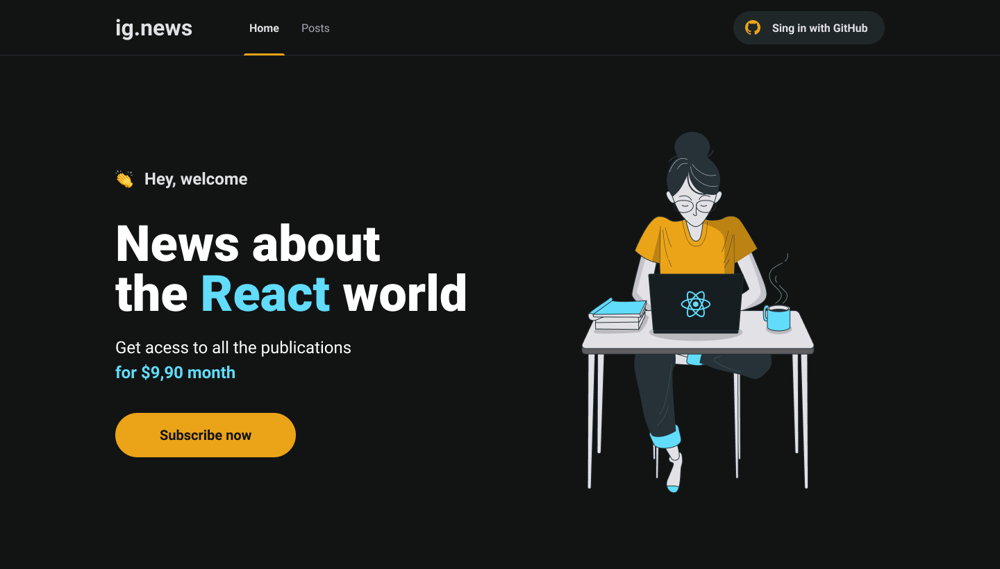
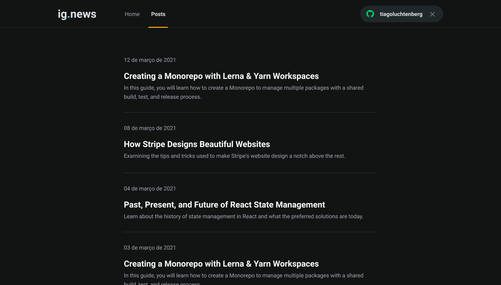
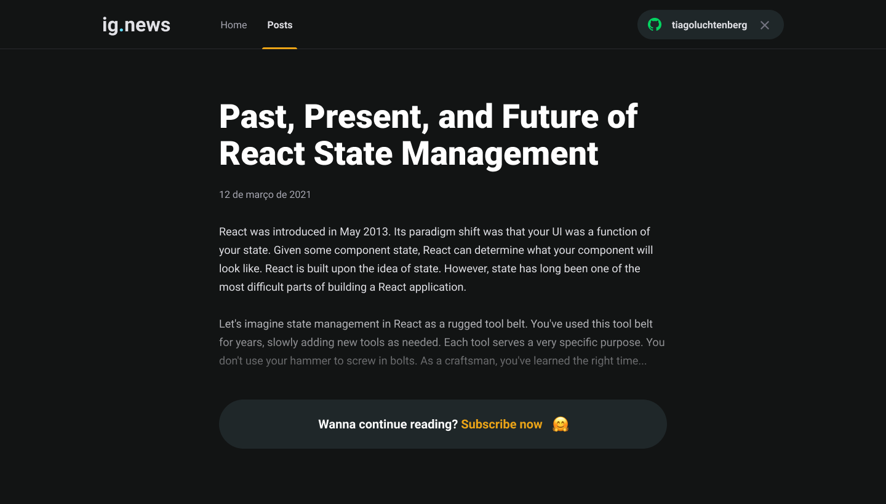
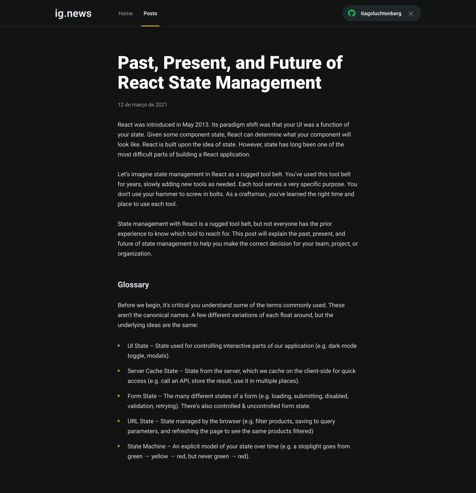

# Rocketseat Ignite - ignews Next.js

# 🛠 Technologies


### front-end

- [axios](https://www.npmjs.com/package/axios)
- [prismic](https://prismic.io)
- [typescript](https://www.typescriptlang.org)
- [axios](https://www.npmjs.com/package/axios)
- [framer-motion](https://www.npmjs.com/package/framer-motion)
- [next-auth](https://next-auth.js.org)
- [nextjs-progressbar](https://www.npmjs.com/package/nextjs-progressbar)
- [react-icons](https://react-icons.github.io/react-icons/)

### back-end
- [faunadb](https://fauna.com)
- [stripe](https://stripe.com/br)


# 🚀 Steps to Setup

 - Create an .env file with:
   - Stripe
      - STRIPE_API_KEY
      - NEXT_PUBLIC_STRIPE_PUBLIC_KEY
      - STRIPE_WEBHOOK_SECRET
      - STRIPE_SUCCESS_URL
      - STRIPE_CANCEL_URL
   - Github
       - GITHUB_CLIENT_ID
       - GITHUB_CLIENT_SECRET
   - FaunaDB
       - FAUNADB_KEY
   - Prismic CMS
       - PRISMIC_ENDPOINT
       - PRIMIC_ACCESS_TOKEN
  
1. Install dependencies

```bash
> yarn
```

2. Run app

```bash
> yarn start
```

Open <http://localhost:3000> to view it in the browser.







